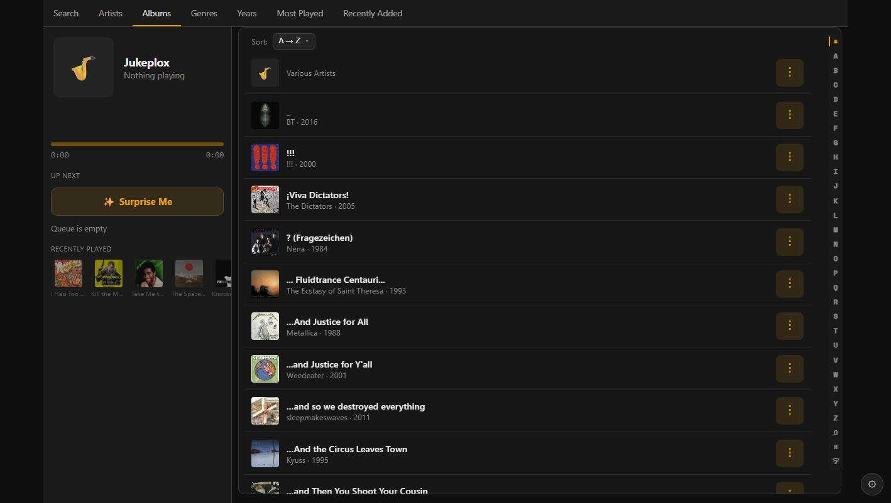
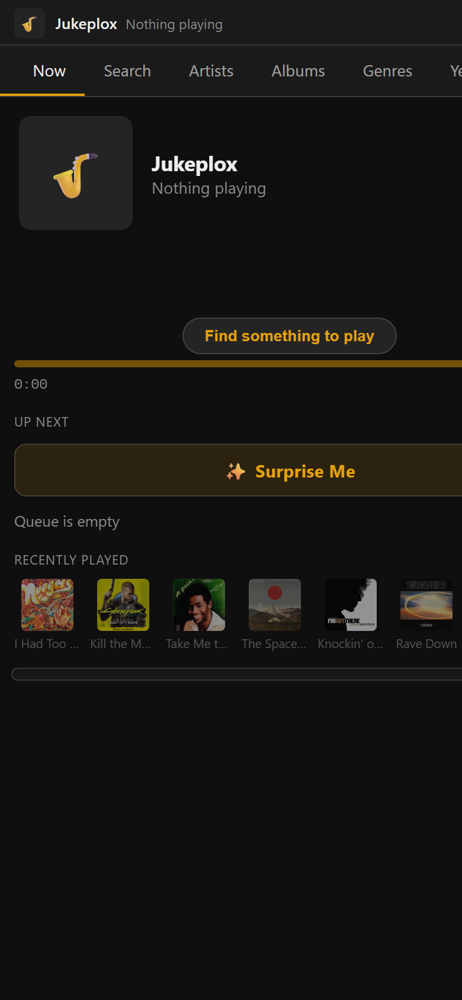

# Jukeplox

A self-hosted party jukebox for your music. Run it on a Linux box; guests open a web
page on their phones to browse your library and queue songs — playing to a Chromecast,
AirPlay, or DLNA speaker, or to speakers wired to the machine. No app, no account, no
password for guests.

Point it at a **Plex**, **Jellyfin**, or **Emby** server, an **OpenSubsonic** server
(Navidrome, gonic, Ampache, Nextcloud Music, LMS/Lyrion), a **local folder** of audio
files, or any mix — Jukeplox merges them into one library.

**Linux only** — Docker host networking (required for speaker discovery) isn't available
on Mac/Windows Docker Desktop.

## Features

- **Multi-source library** — Plex, Jellyfin, Emby, OpenSubsonic (Navidrome & friends), and
  local folders merged into one catalog.
- **Cast anywhere** — Chromecast, AirPlay 2, DLNA/UPnP, or speakers wired to the host.
- **No-app guest access** — guests browse and queue from a phone web page; no install, no
  account, no password.
- **Party-ready** — shared queue, now playing, search, genre and most-played browse,
  gapless playback.
- **Self-hosted** — one Docker container on any Linux box (Raspberry Pi, NAS, or server).

## Screenshots

<p align="center">
  <br>
  <em>Guests browse the merged library — sources combined into one catalog.</em>
</p>
<p align="center">
  <br>
  <em>…and queue from a phone — no app, no account, no login.</em>
</p>

## Built entirely with AI

Jukeplox was designed and written end-to-end by a large language model (Claude), directed
by a human. Every line of code, test, and doc came from an LLM — there is no hand-written
code. It works and is tested, but review it before trusting it on your network, and expect
the quirks that implies. Maintenance is LLM-driven too — see [CONTRIBUTING.md](CONTRIBUTING.md).

## Quick start

```bash
curl -fsSL https://raw.githubusercontent.com/DJRkod/jukeplox/main/install.sh | sh
```

Installs Docker if needed, starts Jukeplox, and opens the browser. Run it as your normal
user (needs `curl`). Then set an admin password, connect Plex, and pick a speaker.

_Prefer to read it first?_ Download the script (the URL above) with `curl -fsSLO`, skim it, then run `sh install.sh`.

**You need:** a Linux host · at least one music source — a Plex server (+ account), a
Jellyfin server, or a folder of audio files · a Chromecast/AirPlay/DLNA speaker, or
speakers attached to the machine.

## Manual install

```bash
docker run -d --name jukeplox \
  --network host \
  --restart unless-stopped \
  -v jukeplox-data:/data \
  -e BIND_HOST=192.168.1.50 \
  djrkod/jukeplox:latest
```

1. Replace `192.168.1.50` with your LAN IP (`hostname -I`). **Casting fails silently if `BIND_HOST` is wrong.**
2. Open `http://<IP>` → set an admin password (**≥12 chars, no reset**) → add a source under **Setup → Libraries** (Plex, Jellyfin, or a local folder) → pick a speaker under **Setup → Output**.
3. Share `http://<IP>` with guests.

Flags: `--network host` finds speakers · `BIND_HOST` lets Chromecast/DLNA pull audio.

**On a NAS that runs its own avahi/mDNS daemon** (e.g. TrueNAS — though there you'd use the
Apps UI, not this command), also add `-v /run/dbus/system_bus_socket:/run/dbus/system_bus_socket`
so Jukeplox can borrow the host's speaker-finder. Regular Linux (desktop, Pi, generic server)
uses in-process discovery and does **not** need it — that socket usually doesn't exist there,
and mounting a missing path makes Docker create a stray directory.

**Port 80 taken?** Add `-e PORT=8096` (keep `--network host`). If you cast, also add
`-e STREAM_BASE_URL=http://<IP>:8096` — or cast devices fetch from :80 and play nothing.

## Play to the machine's own speakers

Add to the `docker run`:

- **Headless / NAS / Pi:** `--device /dev/snd --group-add audio`
- **Linux desktop** (PulseAudio/PipeWire — `/dev/snd` gives "device busy"): `-e PULSE_SERVER=unix:/run/user/$(id -u)/pulse/native -v /run/user/$(id -u)/pulse/native:/run/user/$(id -u)/pulse/native`, run as the desktop user.

Two headless-ALSA gotchas on some hosts:

- Docker masks `/proc/asound` by default, so ALSA can't enumerate cards even with `--device /dev/snd`. Add `--security-opt systempaths=unconfined` (compose: `security_opt: [systempaths=unconfined]`).
- The container doesn't inherit the host's `/etc/asound.conf`. If your host defines a custom `default` PCM (softvol / dmix / a fixed rate), bind-mount it: `-v /etc/asound.conf:/etc/asound.conf:ro`.

Then choose **System Audio** in Setup → Output.

## More music sources

Add sources under **Setup → Libraries**. Your own servers' music libraries switch on and
start indexing on connect (untick any under **Edit libraries…**); a server *shared with
you* stays off until you tick its libraries. **Rescan** rebuilds the catalog on demand
(the catalog rebuilds on connect or a manual rescan, not on restart).

- **Jellyfin** — **Connect Jellyfin** and sign in. Nothing to mount; it's reached over the
  network like Plex, and your password is never stored (only a token).
- **Emby** — **Connect Emby** → server URL + username + password. Like Jellyfin, nothing to
  mount, and the password is never stored — it's exchanged for a token on connect and
  discarded.
- **OpenSubsonic** — **Connect Subsonic** → server URL + API key + username. Covers a range
  of self-hosted servers (see below); **Navidrome is the validated reference**, the others are
  best-effort. Casting a Subsonic source needs one extra setting — see
  [Casting a Subsonic source](#casting-a-subsonic-source-stream_base_url).
- **Local folder** — mount the folder **read-only**, then connect the *container* path (it's
  validated inside the container, so it must be a mount, not a bare host path). Add to the
  `docker run`:

  ```bash
  -v /srv/music:/music:ro
  ```

  Then **Connect Local Folder** → `/music`.

### OpenSubsonic servers

One adapter covers the Subsonic/OpenSubsonic API family. **Navidrome is the validated
reference server**; the rest are expected to work through the same adapter but are
**best-effort only** — not validated:

| Server | Status | Where to get the API key |
|---|---|---|
| **Navidrome** | Validated reference | **Settings → Users → (your user) → API key** |
| gonic | Best-effort | User settings → API key / token |
| Ampache | Best-effort | Web UI → account/preferences → API key (via its Subsonic-compat endpoint) |
| Nextcloud Music | Best-effort | **Generate an app password** in Nextcloud (Settings → Security → *Devices & sessions*) and use it as the key |
| LMS / Lyrion | Best-effort | User/API settings → API key |

Connect under **Setup → Libraries → Connect Subsonic**: enter the **server URL**, the
**API key**, and your **username**. Jukeplox confirms the server supports the OpenSubsonic
**API-Key extension** on connect.

**Legacy Subsonic servers that lack the API-Key extension are unsupported by design.**
Jukeplox never stores a user's password, so a server that only offers the old
password/token+salt auth is rejected at connect rather than silently downgrading. A static,
revocable credential (an API key, or a Nextcloud-style app password) is fine — a raw account
password is not.

> **Note:** only Navidrome is validated on the reference rig. The other servers implement the
> same API and are expected to work, but treat them as best-effort until you've confirmed your
> own server connects and plays.

### Casting a Subsonic source (`STREAM_BASE_URL`)

Subsonic authentication rides in the request **URL** (the API key is a query parameter), so
Jukeplox **always proxies** Subsonic streams through itself — a raw Subsonic URL (with its key)
is never handed to a Chromecast or DLNA device. For that proxy to work, the cast device has to
be able to reach Jukeplox at a device-reachable base URL:

- **Host networking with a specific `BIND_HOST`** (the recommended setup), or `STREAM_BASE_URL`
  explicitly set — this works automatically; nothing extra to do.
- **Docker bridge networking** — the auto-detected address may be an **unreachable container
  address** (e.g. `172.17.x.x`), so cast devices fetch from a base they can't reach and play
  nothing. Set `STREAM_BASE_URL=http://<your-LAN-ip>` (add `:<PORT>` if not `80`), **or** run
  with host networking (`--network host`).

Local-speaker / **System Audio** (Direct) playback is unaffected — it never leaves the host, so
no base URL is involved. Plex, Jellyfin, and Emby use header-based auth and don't require this.

### Reference servers for testing (optional)

Want to try the Subsonic and Emby paths before pointing Jukeplox at your real library? This
`docker-compose.yml` spins up Navidrome, a second Subsonic server (gonic), and Emby to test
against. **This is a local testing aid only** — not part of Jukeplox and not something you
deploy.

```yaml
# docker-compose.yml — local testing aid only (Navidrome + gonic + Emby)
services:
  navidrome:
    image: deluan/navidrome:latest
    ports:
      - "4533:4533"
    environment:
      ND_LOGLEVEL: info
    volumes:
      - ./music:/music:ro           # a folder of test audio
      - navidrome-data:/data

  gonic:
    image: sentriz/gonic:latest
    ports:
      - "4747:80"
    environment:
      GONIC_MUSIC_PATH: /music
      GONIC_PODCAST_PATH: /podcasts
      GONIC_PLAYLISTS_PATH: /playlists
      GONIC_CACHE_PATH: /cache
    volumes:
      - ./music:/music:ro           # same test audio
      - gonic-data:/data
      - gonic-cache:/cache
      - gonic-podcasts:/podcasts
      - gonic-playlists:/playlists

  emby:
    image: emby/embyserver:latest
    ports:
      - "8096:8096"
    environment:
      UID: "1000"
      GID: "1000"
    volumes:
      - ./music:/mnt/music:ro       # same test audio, add as a Music library in Emby
      - emby-config:/config

volumes:
  navidrome-data:
  gonic-data:
  gonic-cache:
  gonic-podcasts:
  gonic-playlists:
  emby-config:
```

Bring them up with `docker compose up -d`, create a user + API key in each server's web UI
(Navidrome `:4533`, gonic `:4747`, Emby `:8096`), then connect each from **Setup → Libraries**.

## Settings (`-e NAME=value`)

| Variable | Default | What it's for |
|---|---|---|
| `BIND_HOST` | `0.0.0.0` | Your LAN IP — set it for Chromecast/DLNA casting. |
| `PORT` | `80` | Web port (the host port directly, under host networking). |
| `STREAM_BASE_URL` | from `BIND_HOST` | `http://<IP>:<PORT>` when `PORT` ≠ 80 with Chromecast/DLNA, behind HTTPS, or to cast a Subsonic source under Docker bridge networking (see [Casting a Subsonic source](#casting-a-subsonic-source-stream_base_url)). |
| `LOG_LEVEL` | `info` | `debug` for troubleshooting. |
| `SESSION_TTL_HOURS` | `8` | How long an admin login lasts. |
| `COOKIE_SECURE` | `false` | Set `true` behind an HTTPS reverse proxy. |
| `ART_CACHE_SIZE_MB` | `512` | Max size of the on-disk album-art cache (LRU eviction). |
| `PLEX_MAX_CONCURRENCY` | `6` | Cap on concurrent requests to any one Plex server (protects small/shared servers). |

## Update

```bash
docker pull djrkod/jukeplox:latest
docker rm -f jukeplox
# then re-run your original command
```

Data in the volume is kept; **run-flags are not** — re-run with the exact flags you used
(`docker inspect jukeplox` first to recover them). Build info at `/api/version` — check
the `git_sha` (the `image_tag` may show an internal release-train name; that's expected).

## Notes

- **Security:** host networking exposes the admin port on all interfaces. Run on a trusted
  LAN; firewall the port if the box is internet-reachable — guest pages need no login.
  Reporting a vulnerability: [`SECURITY.md`](SECURITY.md).
- **Contributing / issues:** [`CONTRIBUTING.md`](CONTRIBUTING.md) (this is an LLM-maintained project).
- **TrueNAS Scale:** install via the Apps UI — see `TrueNAS-README.md`.
- **Step-by-step walkthrough:** `INSTALL.md`.

## License

Jukeplox is licensed under **GPL-2.0-or-later** — see [`LICENSE`](LICENSE). Specifically,
you may redistribute and/or modify it under the terms of the GNU General Public License as
published by the Free Software Foundation, either version 2 of the License, or (at your
option) any later version. It bundles third-party AirPlay binaries and builds on system
libraries (ffmpeg, GStreamer) and Python packages, documented in
[`THIRD_PARTY_LICENSES`](THIRD_PARTY_LICENSES).
